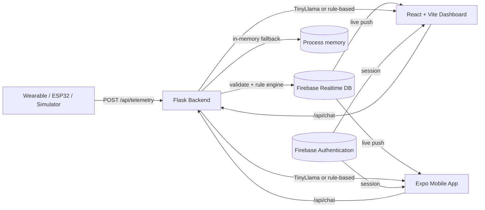

# PulseGuard AI – Smart Health Monitoring Bracelet


> AI-enabled smart health monitoring system. A wearable streams vitals →
> Flask backend validates and analyses → **Firebase Realtime Database**
> fans out → a **web dashboard** and a **mobile app** show live readings
> and a safe healthcare chatbot. **Firebase Authentication** (Email/Password)
> for identity, **Realtime Database** for data. Built for the graduation
> panel; engineered so the demo works even when Firebase, the backend, and
> the AI model are all unavailable.

> **Stack constraints (single source of truth):**
> - Uses **only** Firebase Authentication + Firebase Realtime Database.
> - Does **not** use Cloud Firestore.
> - Does **not** use Cloud Storage.
> - Does **not** use Supabase.

---

## 1. Problem & solution

People with chronic conditions, elderly users, and athletes need to monitor
heart rate, SpO₂, body temperature, activity, and sleep continuously, and
they need clear explanations — not raw numbers — when something is off.

**PulseGuard AI** is an open, end-to-end pipeline: bracelet → REST →
real-time DB → dashboard + mobile + chatbot, with a *rule-first*, AI-second
design so the system is safe and explainable even when the AI is removed.

## 2. Feature overview

- 📈 **Live dashboard** (web + mobile) — vitals + **battery** cards, **wellness
  score**, **activity & stress** signals, **risk hero card**, trend charts,
  alerts feed.
- 📄 **Reports & export** (web + mobile) — daily/weekly summaries, **CSV**
  download, and **PDF** (print) — `/api/reports/*`.
- 🎛️ **Virtual bracelet simulator** with selectable **scenarios** (resting /
  walking / running / fever / stress / anomaly / low-battery) and a `source`
  field (`simulator` / `real_bracelet` / `uploaded_dataset`) that future-proofs
  the schema for real hardware.
- 🔔 **Local push notifications** (mobile) for high-risk vitals + critical
  battery.
- 🔌 **Hardware-ready** — ESP32-C3 reference firmware, BLE GATT spec, and a
  BOM/wiring guide ([firmware/](firmware/), [docs/ble_spec.md](docs/ble_spec.md),
  [docs/hardware.md](docs/hardware.md)).
- 🧠 **Trained ML models** — risk classifier (MLP, 99% acc), anomaly
  autoencoder, intent classifier, an **activity** model on real **UCI HAR**
  (LinearSVM, 96.2%), and the **WESAD stress** model (15-model bake-off, best
  **MLP**, acc 0.93 / ROC-AUC 0.95) served via `POST /api/ml/predict/stress`
  (`backend/models/wesad_stress_artifact.pkl`).
- ⚠️ **Anomaly detection** — server-side deterministic rule engine (AHA/WHO
  reference ranges) + frontend ensemble for trend drift.
- 🤖 **Healthcare chatbot** — a **fine-tuned TinyLlama-1.1B medical LoRA
  adapter** (bundled at `backend/models/medical_slm_adapter/`) wired into
  `/api/chat` and the UI, with a deterministic rule-based assistant as the
  always-on fallback. Enable the model with `LOAD_CHATBOT_MODEL=1` (4-bit NF4
  on GPU, float32 on CPU); test it standalone with `python test_llama.py`.
- 🔥 **Firebase Realtime Database** — sub-second telemetry fan-out to any
  number of clients, with a clear schema and validation rules.
- 🔐 **Firebase Authentication** (Email/Password), with a one-tap **demo
  mode** so the project can be exercised with zero credentials.
- 📲 **Cross-platform mobile app** (Expo React Native) — Android, iOS, web,
  built from one TypeScript codebase.
- 🌐 **PWA-ready web app** — manifest, service worker, offline shell.
- 🧪 **110 backend tests + 54 frontend tests** all green, plus k6/Locust load scripts.
- 🛡️ **Per-route rate limiting** (`flask-limiter`) with a standard 429 envelope.
- ⚙️ **GitHub Actions CI** runs pytest, vitest, ESLint, Vite build, and Expo TS check on every push.
- 🐳 **One-command Docker** stack (`docker compose up --build`).
- 🛡️ Three-tier fallback (Firebase → backend polling → in-browser simulator)
  so the dashboard *always* shows something coherent.

## 3. Architecture



## 4. Tech stack

| Layer | Choice |
|---|---|
| Mobile | Expo SDK 51, React Native 0.74, Expo Router, TypeScript |
| Web | React 18 + Vite + TypeScript + Tailwind + shadcn/ui + Recharts |
| Backend | Python 3.12, Flask 3, flask-cors, gunicorn |
| AI | TinyLlama-1.1B-Chat + PEFT/LoRA (optional) |
| Realtime DB | Firebase Realtime Database (with in-memory fallback) |
| Auth | **Firebase Authentication** (Email/Password) |
| Tests | pytest, vitest, manual mobile plan, k6, Locust |
| Container | Docker + docker-compose + nginx |

## 5. Folder structure

```
graduation-project/
├── backend/                     # Flask API + AI + Firebase Admin
│   ├── app.py                   #   Endpoint definitions, app factory
│   ├── anomaly_detection.py     #   Rule engine + validator + wellness/activity/stress
│   ├── reports.py               #   Daily/weekly summary + CSV export
│   ├── chatbot_service.py       #   Fine-tuned TinyLlama+LoRA generation + rule fallback
│   ├── ml/training/             #   train_all + activity (UCI HAR) pipelines
│   ├── models/medical_slm_adapter/  #   bundled fine-tuned medical LoRA adapter
│   ├── firebase_service.py      #   RTDB adapter (+ in-memory fallback)
│   ├── simulator.py             #   Synthetic telemetry generator (CLI + lib, modes)
│   ├── responses.py             #   Standard JSON envelope
│   ├── logging_config.py        #   X-Request-ID + access log
│   ├── tests/                   #   110 pytest cases
│   ├── requirements*.txt
│   ├── Dockerfile
│   └── .env.example
├── mobile/                      # Expo React Native app
│   ├── app/                     #   Expo Router screens (splash, auth, tabs)
│   ├── src/                     #   Hooks (Firebase Auth + live telemetry), lib, config
│   ├── app.json, package.json, tsconfig.json
│   └── README.md
├── src/                         # Web dashboard (React + Vite + TS)
│   ├── pages/                   #   Dashboard, Auth, Chat, Alerts, Analytics, Profile
│   ├── components/              #   shadcn/ui + custom (MetricCard, RiskHeroCard, TelemetrySourceBadge, ...)
│   ├── hooks/                   #   useAuth (Firebase), useHealthData, useLiveTelemetry
│   ├── integrations/
│   │   └── firebase/            #   Firebase Auth + RTDB client wrapper
│   └── lib/                     #   health-data, anomaly-detection
├── firmware/                    # Bracelet reference firmware (ESP32-C3 → /api/telemetry)
│   ├── src/main.cpp, src/config.h
│   ├── platformio.ini
│   └── README.md
├── docs/                        # api, deployment, testing, performance,
│                                # security, observability, demo_script,
│                                # final_defense_answers, maturity_checklist_mapping,
│                                # team_contributions, firebase, ai_production_checklist,
│                                # hardware (BOM/wiring), ble_spec (GATT)
├── load_tests/                  # k6 + Locust scripts
├── final_evidence/              # Defense proof drawer (screenshots, logs, ...)
├── public/                      # logo, manifest.webmanifest, sw.js
├── firebase.rules.json          # RTDB security rules (auth.uid === $uid)
├── docker-compose.yml
├── Dockerfile.frontend
├── nginx.conf
├── chatbot.py                   # Legacy single-file backend (still works)
├── test_llama.py                # Standalone TinyLlama+LoRA inference test
├── package.json, vite.config.ts, vitest.config.ts, tailwind.config.ts
└── .env.example
```

## 6. Quick start

### One-command (Docker)
```bash
docker compose up --build
# Web:  http://localhost:8080
# API:  http://localhost:5000/health

# Same plus a server-side simulator pumping data every 2s:
docker compose --profile demo up --build
```

### Manual

**Backend**
```bash
cd backend
python -m venv .venv
.venv\Scripts\Activate.ps1                 # Windows PowerShell
# source .venv/bin/activate                # macOS / Linux
pip install -r requirements.txt
cp .env.example .env                       # edit if you have Firebase Admin creds
python -m backend.app                      # http://127.0.0.1:5000
```

**Web dashboard**
```bash
cp .env.example .env                       # fill VITE_FIREBASE_* values
npm install
npm run dev                                # http://localhost:8080
```

**Mobile app**
```bash
cd mobile
cp .env.example .env                       # fill EXPO_PUBLIC_FIREBASE_* and EXPO_PUBLIC_API_BASE_URL
npm install
npx expo start                             # press 'a' Android, 'i' iOS, 'w' web
```
On the auth screen tap **"Continue as demo"** if you don't have credentials.

### Optional: pump synthetic readings
```bash
python -m backend.simulator --uid demo-user-001 --interval 2 --count 60
```

### Run the tests
```bash
pytest backend/tests -v                    # 110 backend tests
npm test                                   # 54 frontend vitest tests
cd mobile && npm run tsc                   # mobile type check
```

### Run the load tests
```bash
k6 run -e USERS=25 -e DURATION=60s load_tests/k6_backend_test.js
# or
locust -f load_tests/locustfile.py --host http://127.0.0.1:5000 -u 25 -r 5 -t 1m --headless
```

## 7. Configuration

See **three** env example files:
- [.env.example](./.env.example) — web dashboard (`VITE_*`)
- [backend/.env.example](./backend/.env.example) — Flask backend
- [mobile/.env.example](./mobile/.env.example) — Expo (`EXPO_PUBLIC_*`)

Demo mode requires zero env values.

## 8. Firebase data model

Standard paths (validated by [firebase.rules.json](./firebase.rules.json)):

```
users/{uid}/latest_telemetry         # one node, overwritten on every ingest
users/{uid}/history/{push_id}        # full history (capped at 500 in fallback)
users/{uid}/alerts/{push_id}         # only when risk_level != "normal"
users/{uid}/profile                  # editable personal info
```

Schema example:
```json
{
  "heart_rate": 78,
  "spo2": 97,
  "temperature_c": 36.8,
  "steps": 1200,
  "calories": 45.5,
  "sleep_duration_sec": 3600,
  "risk_level": "normal",
  "alert_message": "Vitals are within normal range.",
  "timestamp": 1779716107821
}
```

Full reference: [docs/firebase.md](./docs/firebase.md).

## 9. API documentation

Every endpoint, request/response shape, error code, and validation rule:
[docs/api.md](./docs/api.md). OpenAPI document at
[docs/openapi.yaml](./docs/openapi.yaml).

## 10. Documentation index

| Document | What it covers |
|---|---|
| [docs/api.md](./docs/api.md) | All endpoints, schemas, error codes |
| [docs/deployment.md](./docs/deployment.md) | Local, Docker, prod, rollback, troubleshooting |
| [docs/testing.md](./docs/testing.md) | 110-test catalog, frontend + mobile plans |
| [docs/performance.md](./docs/performance.md) | Load testing, bottlenecks, mitigations |
| [docs/security.md](./docs/security.md) | Auth, secrets, validation, medical safety, known limits |
| [docs/observability.md](./docs/observability.md) | Logs, /health, /api/metrics, debugging recipes |
| [docs/firebase.md](./docs/firebase.md) | Schema, helpers, fallback, seeding, Auth model |
| [docs/hardware.md](./docs/hardware.md) | Bracelet BOM, I²C map, battery math, enclosure/PCB notes |
| [docs/ble_spec.md](./docs/ble_spec.md) | BLE GATT contract (HRS + Battery + custom service) |
| [docs/demo_script.md](./docs/demo_script.md) | 8-minute defense walkthrough |
| [docs/final_defense_answers.md](./docs/final_defense_answers.md) | The 22 likely panel questions, answered |
| [docs/maturity_checklist_mapping.md](./docs/maturity_checklist_mapping.md) | Honest scoring against the maturity checklist |
| [docs/team_contributions.md](./docs/team_contributions.md) | Who did what |
| [docs/ai_production_checklist.md](./docs/ai_production_checklist.md) | What we did / didn't / would need for clinical deployment |

## 11. Demo flow

1. `docker compose --profile demo up --build`
2. Open <http://localhost:8080>, sign in with Firebase (or tap **Continue as demo**).
3. Watch the metric cards update; the simulator pumps every 2s.
4. Fire a deliberate high-risk reading via `curl` (see [docs/demo_script.md](./docs/demo_script.md#4-trigger-an-alert-45-s)).
5. Open **Alerts** — the new entry appears with risk reasons.
6. Open **AI Chat** — ask "Am I okay?" — get a safe, disclaimer-bearing reply.
7. Show `curl http://localhost:5000/api/metrics` for live counters.
8. Show the backend log line with the matching `X-Request-ID`.

Full script: [docs/demo_script.md](./docs/demo_script.md).

## 12. Known limitations

- No bundled real PEFT/LoRA medical adapter (path is supported via env).
- The in-memory fallback is per-process, so multi-worker gunicorn won't
  share state — fine for the demo, removed by deploying real Firebase.
- Mobile charts are simple lists; a `react-native-svg` chart is a follow-up.
- No physical ESP32 bracelet is bundled — the simulator stands in.
- Push notifications on critical risk are not yet wired up.

## 13. Future work

- Deploy the rules + project to production Firebase.
- `flask-limiter` rate limits, Sentry exception aggregation, Prometheus metrics.
- Remote push on `risk_level == "high"` (FCM/APNs). The mobile app already
  raises **local** notifications for high-risk + critical-battery alerts
  ([mobile/src/hooks/useAlertNotifications.ts](./mobile/src/hooks/useAlertNotifications.ts));
  remote push is the dev-build upgrade.
- Assemble + calibrate a physical bracelet (reference firmware, BLE spec, and
  BOM are in [firmware/](./firmware/) and [docs/hardware.md](./docs/hardware.md)).
- Clinician-mode UI: read-only view across many users for a care team.

## 13b. Known limitations & future work

Honest scope notes (see [docs/live_demo_report.md](./docs/live_demo_report.md)
for the full live-demo audit):

**1. Firebase legacy records.** The real Firebase project still contains
older/partial telemetry records (e.g. `temperature_f`, no `spo2`/`battery`).
The app now **normalizes and validates every record on read** — `temperature_f`
→ Celsius, ×10 values rescaled, and physiologically impossible values
(heart_rate, spo2, temperature) are **rejected or dropped** before they reach
the dashboard, chatbot, or ML. *Future work:* a one-time Firebase migration, or
making the backend the **sole writer** so stored records are always canonical.

**2. WESAD live compatibility.** The WESAD stress model is trained and
integrated (`backend/models/wesad_stress_artifact.pkl`, served at
`POST /api/ml/predict/stress`). It is **not** used for live stress inference
from the current Firebase schema, because that schema / a basic bracelet does
**not** provide the required **252 WESAD features** (raw multi-channel wrist+
chest BVP/EDA/ECG/EMG/ACC windows). The app **does not fake** missing features;
live stress in the demo uses a **deterministic stress heuristic**. *Future
work:* collect compatible bracelet signals, or train a new stress model on the
actual bracelet/Firebase fields.

**3. Mobile status.** The mobile code is aligned with the shared telemetry
contract (same `useLiveTelemetry` hook + snake_case schema; chat sends live
telemetry). It was **not visually run** in this environment (no emulator/
device/runtime available). *Future work:* run and validate the Expo app on an
emulator/device.

## 13c. How to explain this in the defense

- This is a **software-first AI health-monitoring platform** — built to run
  fully without hardware, and ready to accept a real bracelet later.
- The current demo uses **simulator-fed backend telemetry as the authoritative
  source**.
- The backend exposes **one normalized contract** via `GET /api/vitals/latest`.
- The **dashboard, chatbot, alerts, analytics, and reports all read the same
  data contract** — no component invents or uses stale values.
- **WESAD is integrated** but only runs with compatible feature input; live
  stress falls back to a transparent deterministic signal.
- The assistant is a **wellness assistant, not a medical diagnostic tool** — it
  never diagnoses and recommends professional care for serious symptoms.

## 14. Team & contributions

| Member | Program | Headline |
|---|---|---|
| Omar Medhat | DSAI | AI chatbot, Flask backend, model loading & safety |
| Asmaa Desokey | DSAI | Simulation, anomaly engine, patient scenarios |
| Lama Omar | Software | Dashboard, UI components, Firebase Auth, mobile UI |

Full breakdown: [docs/team_contributions.md](./docs/team_contributions.md).

## 15. Medical disclaimer

> PulseGuard AI is a **graduation project**. It provides health information
> for **educational purposes only** and is **not a substitute for
> professional medical advice, diagnosis, or treatment**. Always seek the
> advice of a qualified healthcare provider for any medical concerns.

## License

Internal Graduation Project – All Rights Reserved.

---
*Developed as part of the PulseGuard AI / CareWave Companion ecosystem.*
